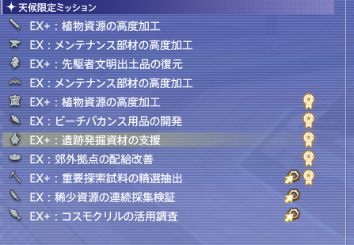
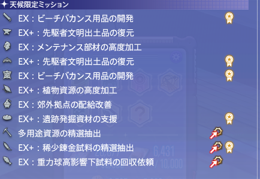
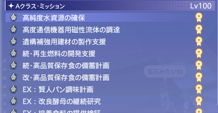
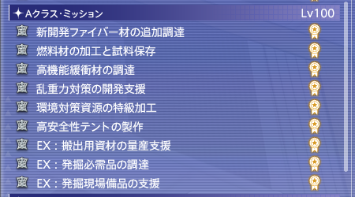
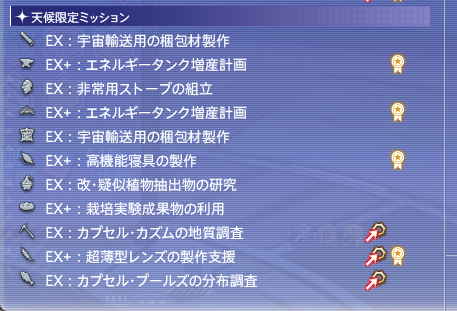

# コスモエクスプローラー 検証データ＆報酬ログまとめ

このファイルは、コスモエクスプローラーの期待値計算の精度を高めるために、ゲーム内で得られた報酬やドロップ率のデータを雑に書き溜めておくためのメモ帳です。

**📸 スクリーンショットについて**
ルーレットの盤面など、画像データは同じフォルダ内にある `screenshots/` ディレクトリに保存してください。ファイル名は適当で構いません。後で50枚ほど貯まったら一括でスクリプトで解析します！

---

## 📝 報酬ログの貼り付けフォーマット

チャットログからコピーしたシステムメッセージをそのまま貼り付けていただくだけでOKです！
後でプログラム（Python）で件数や平均値を自動スクレイピングして計算できるように、以下の形式でログブロックを囲んでいただけると非常に助かります。

### 【追加用テンプレート】（ここから下へどんどん追加してください）

#### エリア: （エリア名を記載：オイジュス / パエンナ / 焦がれの入り江 レモネード等）
* ランク: （特定できれば記載：EX+ 採掘、Aランク、メカオペなど）
```text
（ここにチャットログのシステムメッセージをそのままコピペ）
例:
「パエンナクレジット」を50個入手した。
「惑星パエンナ探索計画の証書」を1個入手した。
```
---

### エリア: オイジュス
技巧点獲得しているのがジョブ。
EX+：遺跡発掘資材の支援は天候ミッション

曇りの時のミッション名が↑。


↑晴れの時のミッション名


錬金のAミッションが↑


革Aミッション↑

EX+：稀少エーテル植物の効率調査は時限ミッション

* ランク: 
```text
[20:01] Maya Buunはコスモミッション「EX+：遺跡発掘資材の支援」をゴールドグレードでコンプリートした！
[20:01] 1ゴールドカウントを達成した!
[20:01] コスモクレジット×325を手に入れた。
[20:01] オイジュスクレジット×290(+75)を手に入れた。
[20:01] 錬金術師の技巧点を1900点獲得した！
[20:01] 調査員により、とても大きな活躍が記録された。
[20:01] Maya Buunは惑星オイジュス探索計画の手形×215を手に入れた。
```
---

* ランク: 
```text
[20:05] Maya Buunはコスモミッション「EX+：遺跡発掘資材の支援」をゴールドグレードでコンプリートした！
[20:05] 2ゴールドカウントにより、報酬量が5%増加した！
[20:05] コスモクレジット×341(+16)を手に入れた。
[20:05] オイジュスクレジット×303(+88)を手に入れた。
[20:05] オイジュス・ドローンチップ×245(+11)を手に入れた。
[20:05] 錬金術師の技巧点を1900点獲得した！
[20:05] 調査員により、とても大きな活躍が記録された。
[20:05] Maya Buunは惑星オイジュス探索計画の手形×215を手に入れた。
```
---

* ランク: 
```text
[20:10] Maya Buunはコスモミッション「EX+：遺跡発掘資材の支援」をシルバーグレードでコンプリートした！
[20:10] コスモクレジット×260を手に入れた。
[20:10] オイジュスクレジット×232(+60)を手に入れた。
[20:10] 錬金術師の技巧点を1520点獲得した！
[20:10] 調査員により、大きな活躍が記録された。
[20:10] Maya Buunは惑星オイジュス探索計画の手形×172を手に入れた。
[20:10] ゴールドグレードを達成できなかった為、ゴールドカウントがリセットされました。
```
---

* ランク: 
```text
[20:14] Maya Buunはコスモミッション「EX+：遺跡発掘資材の支援」をゴールドグレードでコンプリートした！
[20:14] 1ゴールドカウントを達成した!
[20:14] コスモクレジット×325を手に入れた。
[20:14] オイジュスクレジット×290(+75)を手に入れた。
[20:14] 錬金術師の技巧点を1900点獲得した！
[20:14] 調査員により、とても大きな活躍が記録された。
[20:14] Maya Buunは惑星オイジュス探索計画の手形×215を手に入れた。
```
---

* ランク: 
```text
20:18] Maya Buunはコスモミッション「EX+：遺跡発掘資材の支援」をゴールドグレードでコンプリートした！
[20:18] 2ゴールドカウントにより、報酬量が5%増加した！
[20:18] コスモクレジット×341(+16)を手に入れた。
[20:18] オイジュスクレジット×303(+88)を手に入れた。
[20:18] オイジュス・ドローンチップ×245(+11)を手に入れた。
[20:18] 錬金術師の技巧点を1900点獲得した！
[20:18] 調査員により、とても大きな活躍が記録された。
```
---

* ランク: 
```text
[20:22] Maya Buunはコスモミッション「EX+：遺跡発掘資材の支援」をゴールドグレードでコンプリートした！
[20:22] 3ゴールドカウントにより、報酬量が10%増加した！
[20:22] コスモクレジット×357(+32)を手に入れた。
[20:22] オイジュスクレジット×318(+103)を手に入れた。
[20:22] オイジュス・ドローンチップ×257(+23)を手に入れた。
[20:22] 錬金術師の技巧点を1900点獲得した！
[20:22] 調査員により、とても大きな活躍が記録された。
[20:22] Maya Buunは惑星オイジュス探索計画の手形×215を手に入れた。
```
---

* ランク: 
```text
[20:26] Maya Buunはコスモミッション「EX+：遺跡発掘資材の支援」をゴールドグレードでコンプリートした！
[20:26] 4ゴールドカウントにより、報酬量が15%増加した！
[20:26] コスモクレジット×373(+48)を手に入れた。
[20:26] オイジュスクレジット×333(+118)を手に入れた。
[20:26] オイジュス・ドローンチップ×269(+35)を手に入れた。
[20:26] 錬金術師の技巧点を1900点獲得した！
[20:26] 調査員により、とても大きな活躍が記録された。
[20:26] Maya Buunは惑星オイジュス探索計画の手形×215を手に入れた。
```
---

* ランク: 
```text
[20:30] Maya Buunはコスモミッション「EX+：遺跡発掘資材の支援」をシルバーグレードでコンプリートした！
[20:30] コスモクレジット×260を手に入れた。
[20:30] オイジュスクレジット×232(+60)を手に入れた。
[20:30] 錬金術師の技巧点を1520点獲得した！
[20:30] 調査員により、大きな活躍が記録された。
[20:30] Maya Buunは惑星オイジュス探索計画の手形×172を手に入れた。
[20:30] ゴールドグレードを達成できなかった為、ゴールドカウントがリセットされました。
```
---

* ランク: 
```text
[20:32] Maya Buunはコスモミッション「EX+：稀少エーテル植物の効率調査」をゴールドグレードでコンプリートした！
[20:32] 1ゴールドカウントを達成した!
[20:32] コスモクレジット×125を手に入れた。
[20:32] オイジュスクレジット×114(+29)を手に入れた。
[20:32] 園芸師の技巧点を820点獲得した！
[20:32] 調査員により、大きな活躍が記録された。
[20:32] Maya Buunは惑星オイジュス探索計画の手形×85を手に入れた。
```
---

* ランク: 
複数ミッションのログを貼ってる
```text
20:34] Maya Buunはコスモミッション「EX+：稀少エーテル植物の効率調査」をゴールドグレードでコンプリートした！
[20:34] 2ゴールドカウントにより、報酬量が5%増加した！
[20:34] コスモクレジット×131(+6)を手に入れた。
[20:34] オイジュスクレジット×120(+35)を手に入れた。
[20:34] オイジュス・ドローンチップ×113(+5)を手に入れた。
[20:34] 園芸師の技巧点を820点獲得した！
[20:34] 調査員により、大きな活躍が記録された。
[20:34] Maya Buunは惑星オイジュス探索計画の手形×85を手に入れた。
[20:34] コスモミッションで使用したGP1600を回復しました。
[20:34] コスモミッション「EX+：稀少エーテル植物の効率調査」を開始した。
[20:34] 特殊アクション「エクステンドリサーチ」が使用可能になった！
[20:34] Maya BuunはコスモミッションでGP500を消費した（合計500）
[20:35] Maya BuunはコスモミッションでGP300を消費した（合計800）
[20:35] Maya BuunはコスモミッションでGP500を消費した（合計1300）
[20:35] Maya BuunはコスモミッションでGP300を消費した（合計1600）
[20:36] ゴールドグレード評価を達成しました！
[20:36] コスモミッションの目標を達成した！
[20:36] コスモミッションの評価が確定しました。
[20:36] 「進行中ミッション」ウィンドウから「報告」を選択して、ミッションを完了してください。
[20:36] Maya Buunはコスモミッション「EX+：稀少エーテル植物の効率調査」をゴールドグレードでコンプリートした！
[20:36] 3ゴールドカウントにより、報酬量が10%増加した！
[20:36] コスモクレジット×137(+12)を手に入れた。
[20:36] オイジュスクレジット×125(+40)を手に入れた。
[20:36] オイジュス・ドローンチップ×118(+10)を手に入れた。
[20:36] 園芸師の技巧点を820点獲得した！
[20:36] 調査員により、大きな活躍が記録された。
[20:36] Maya Buunは惑星オイジュス探索計画の手形×85を手に入れた。
[20:36] コスモミッションで使用したGP1600を回復しました。
[20:36] コスモミッション「EX+：稀少エーテル植物の効率調査」を開始した。
[20:36] 特殊アクション「エクステンドリサーチ」が使用可能になった！
[20:36] Maya BuunはコスモミッションでGP500を消費した（合計500）
[20:36] Maya BuunはコスモミッションでGP300を消費した（合計800）
[20:36] 攻略手帳『採集活動』のコンプリートが近づいた！
[20:36] 攻略手帳『採集活動』をコンプリートした！
[20:36] 1,000ギルを手に入れた。
[20:37] Maya BuunはコスモミッションでGP300を消費した（合計1100）
[20:37] Maya BuunはコスモミッションでGP500を消費した（合計1600）
[20:37] ゴールドグレード評価を達成しました！
[20:37] コスモミッションの目標を達成した！
[20:37] コスモミッションの評価が確定しました。
[20:37] 「進行中ミッション」ウィンドウから「報告」を選択して、ミッションを完了してください。
[20:37] Maya Buunはコスモミッション「EX+：稀少エーテル植物の効率調査」をゴールドグレードでコンプリートした！
[20:37] 4ゴールドカウントにより、報酬量が15%増加した！
[20:37] コスモクレジット×143(+18)を手に入れた。
[20:37] オイジュスクレジット×130(+45)を手に入れた。
[20:37] オイジュス・ドローンチップ×124(+16)を手に入れた。
[20:37] 園芸師の技巧点を820点獲得した！
[20:37] 調査員により、大きな活躍が記録された。
[20:37] Maya Buunは惑星オイジュス探索計画の手形×85を手に入れた。
[20:37] コスモミッションで使用したGP1600を回復しました。
[20:37] コスモミッション「EX+：稀少エーテル植物の効率調査」を開始した。
[20:37] 特殊アクション「エクステンドリサーチ」が使用可能になった！
[20:37] Maya BuunはコスモミッションでGP500を消費した（合計500）
[20:38] 緊急状況中につき、緊急ミッションの参加要請が届いています。
エクスプローラータブレットの「コスモミッション」から、「緊急ミッション」の受注が可能です。
[20:38] Maya BuunはコスモミッションでGP500を消費した（合計1000）
[20:38] Maya BuunはコスモミッションでGP500を消費した（合計1500）
[20:39] ゴールドグレード評価を達成しました！
[20:39] コスモミッションの目標を達成した！
[20:39] コスモミッションの評価が確定しました。
[20:39] 「進行中ミッション」ウィンドウから「報告」を選択して、ミッションを完了してください。
[20:39] Maya Buunはコスモミッション「EX+：稀少エーテル植物の効率調査」をゴールドグレードでコンプリートした！
[20:39] 5ゴールドカウントにより、報酬量が20%増加した！
[20:39] コスモクレジット×150(+25)を手に入れた。
[20:39] オイジュスクレジット×137(+52)を手に入れた。
[20:39] オイジュス・ドローンチップ×129(+21)を手に入れた。
[20:39] 園芸師の技巧点を820点獲得した！
[20:39] 調査員により、大きな活躍が記録された。
[20:39] Maya Buunは惑星オイジュス探索計画の手形×85を手に入れた。
[20:39] コスモミッションで使用したGP1500を回復しました。
[20:39] コスモミッション「EX+：稀少エーテル植物の効率調査」を開始した。
[20:39] 特殊アクション「エクステンドリサーチ」が使用可能になった！
[20:39] Maya BuunはコスモミッションでGP500を消費した（合計500）
[20:39] Maya BuunはコスモミッションでGP300を消費した（合計800）
[20:39] Maya BuunはコスモミッションでGP300を消費した（合計1100）
[20:40] Maya BuunはコスモミッションでGP500を消費した（合計1600）
[20:40] Maya BuunはコスモミッションでGP500を消費した（合計2100）
[20:40] ゴールドグレード評価を達成しました！
[20:40] コスモミッションの目標を達成した！
[20:40] コスモミッションの評価が確定しました。
[20:40] 「進行中ミッション」ウィンドウから「報告」を選択して、ミッションを完了してください。
[20:40] Maya Buunはコスモミッション「EX+：稀少エーテル植物の効率調査」をゴールドグレードでコンプリートした！
[20:40] ゴールドスターを達成した事により、報酬量が30%増加し、ゴールドカウントがリセットされた。
[20:40] コスモクレジット×162(+37)を手に入れた。
[20:40] オイジュスクレジット×148(+63)を手に入れた。
[20:40] オイジュス・ドローンチップ×140(+32)を手に入れた。
[20:40] 園芸師の技巧点を820点獲得した！
[20:40] 調査員により、大きな活躍が記録された。
[20:40] Maya Buunは惑星オイジュス探索計画の手形×85を手に入れた。
[20:40] コスモミッションで使用したGP2100を回復しました。
[20:40] コーディアル類のリキャストタイマーをリセットしました。


```
---

* ランク: 
```text
[20:47] Maya Buunはコスモミッション「遺構補強用建材の製作支援」をゴールドグレードでコンプリートした！
[20:47] 1ゴールドカウントを達成した!
[20:47] コスモクレジット×50を手に入れた。
[20:47] オイジュスクレジット×54(+14)を手に入れた。
[20:47] 錬金術師の技巧点を125点獲得した！
[20:47] 調査員により、大きな活躍が記録された。
```
---

* ランク: 
```text
[20:50] Maya Buunはコスモミッション「高度通信機器用磁性流体の調達」をゴールドグレードでコンプリートした！
[20:50] 2ゴールドカウントにより、報酬量が5%増加した！
[20:50] コスモクレジット×57(+2)を手に入れた。
[20:50] オイジュスクレジット×63(+18)を手に入れた。
[20:50] オイジュス・ドローンチップ×42(+2)を手に入れた。
[20:50] 錬金術師の技巧点を120点獲得した！
[20:50] 調査員により、大きな活躍が記録された。
```
---

* ランク: 
```text
[20:52] Maya Buunはコスモミッション「高純度水資源の確保」をゴールドグレードでコンプリートした！
[20:52] 3ゴールドカウントにより、報酬量が10%増加した！
[20:52] コスモクレジット×60(+5)を手に入れた。
[20:52] オイジュスクレジット×66(+21)を手に入れた。
[20:52] オイジュス・ドローンチップ×50(+4)を手に入れた。
[20:52] 錬金術師の技巧点を135点獲得した！
[20:52] 調査員により、大きな活躍が記録された。
```
---

* ランク: 
```text
[20:54] Maya Buunはコスモミッション「高度通信機器用磁性流体の調達」をゴールドグレードでコンプリートした！
[20:54] 4ゴールドカウントにより、報酬量が15%増加した！
[20:54] コスモクレジット×63(+8)を手に入れた。
[20:54] オイジュスクレジット×68(+23)を手に入れた。
[20:54] オイジュス・ドローンチップ×46(+6)を手に入れた。
[20:54] 錬金術師の技巧点を120点獲得した！
```
---

* ランク: 
```text
[20:56] Maya Buunはコスモミッション「高純度水資源の確保」をゴールドグレードでコンプリートした！
[20:56] 5ゴールドカウントにより、報酬量が20%増加した！
[20:56] コスモクレジット×66(+11)を手に入れた。
[20:56] オイジュスクレジット×72(+27)を手に入れた。
[20:56] オイジュス・ドローンチップ×55(+9)を手に入れた。
[20:56] 錬金術師の技巧点を135点獲得した！
[20:56] 調査員により、大きな活躍が記録された。
```
---

* ランク: 
```text
[20:58] Maya Buunはコスモミッション「遺構補強用建材の製作支援」をゴールドグレードでコンプリートした！
[20:58] ゴールドスターを達成した事により、報酬量が30%増加し、ゴールドカウントがリセットされた。
[20:58] コスモクレジット×65(+15)を手に入れた。
[20:58] オイジュスクレジット×70(+30)を手に入れた。
[20:58] オイジュス・ドローンチップ×54(+12)を手に入れた。
[20:58] 錬金術師の技巧点を125点獲得した！
[20:58] 調査員により、大きな活躍が記録された。
```
---

* ランク: 
```text
[7:39] Maya Buunはコスモミッション「EX+：先駆者文明出土品の復元」をゴールドグレードでコンプリートした！
[7:39] 2ゴールドカウントにより、報酬量が5%増加した！
[7:39] コスモクレジット×341(+16)を手に入れた。
[7:39] オイジュスクレジット×303(+88)を手に入れた。
[7:39] オイジュス・ドローンチップ×245(+11)を手に入れた。
[7:39] 彫金師の技巧点を1900点獲得した！
[7:39] 調査員により、とても大きな活躍が記録された。
[7:39] Maya Buunは惑星オイジュス探索計画の手形×215を手に入れた。
[7:39] コスモミッション「EX+：先駆者文明出土品の復元」を開始した。
[7:39] コスモコンテナ×2が支給された。
[7:39] 特殊アクション「ミラクルマテリアル」が使用可能になった！
[7:40] 次のマクロへ <se.8>
[7:40] 次のマクロへ <se.8>
[7:41] 完成！ <se.8>
[7:41] 評価値1000を獲得しました。
[7:42] 次のマクロへ <se.8>
[7:42] 次のマクロへ <se.8>
[7:43] 完成！ <se.8>
[7:43] 評価値1000を獲得しました。
[7:43] ゴールドグレード評価を達成しました！
[7:43] コスモミッションの目標を達成した！
[7:43] 全ての製作素材を使い切りました。
[7:43] 「進行中ミッション」ウィンドウから「報告」を選択して、ミッションを完了してください。
[7:43] Maya Buunはコスモミッション「EX+：先駆者文明出土品の復元」をゴールドグレードでコンプリートした！
[7:43] 3ゴールドカウントにより、報酬量が10%増加した！
[7:43] コスモクレジット×357(+32)を手に入れた。
[7:43] オイジュスクレジット×318(+103)を手に入れた。
[7:43] オイジュス・ドローンチップ×257(+23)を手に入れた。
[7:43] 彫金師の技巧点を1900点獲得した！
[7:43] 調査員により、とても大きな活躍が記録された。
[7:43] Maya Buunは惑星オイジュス探索計画の手形×215を手に入れた。
[7:43] コスモミッション「EX+：先駆者文明出土品の復元」を開始した。
[7:43] コスモコンテナ×2が支給された。
[7:43] 特殊アクション「ミラクルマテリアル」が使用可能になった！
[7:44] 次のマクロへ <se.8>
[7:44] 次のマクロへ <se.8>
[7:45] 完成！ <se.8>
[7:45] 評価値1000を獲得しました。
[7:45] 次のマクロへ <se.8>
[7:46] 次のマクロへ <se.8>
[7:47] 完成！ <se.8>
[7:47] 評価値1000を獲得しました。
[7:47] ゴールドグレード評価を達成しました！
[7:47] コスモミッションの目標を達成した！
[7:47] 全ての製作素材を使い切りました。
[7:47] 「進行中ミッション」ウィンドウから「報告」を選択して、ミッションを完了してください。
[7:47] Maya Buunはコスモミッション「EX+：先駆者文明出土品の復元」をゴールドグレードでコンプリートした！
[7:47] 4ゴールドカウントにより、報酬量が15%増加した！
[7:47] コスモクレジット×373(+48)を手に入れた。
[7:47] オイジュスクレジット×333(+118)を手に入れた。
[7:47] オイジュス・ドローンチップ×269(+35)を手に入れた。
[7:47] 彫金師の技巧点を1900点獲得した！
[7:47] 調査員により、とても大きな活躍が記録された。
[7:47] Maya Buunは惑星オイジュス探索計画の手形×215を手に入れた。
[7:47] コスモミッション「EX+：先駆者文明出土品の復元」を開始した。
[7:47] コスモコンテナ×2が支給された。
[7:47] 特殊アクション「ミラクルマテリアル」が使用可能になった！
[7:47] 次のマクロへ <se.8>
[7:48] 次のマクロへ <se.8>
[7:49] 完成！ <se.8>
[7:49] 評価値1000を獲得しました。
[7:49] 次のマクロへ <se.8>
[7:50] 次のマクロへ <se.8>
[7:50] 完成！ <se.8>
[7:51] 評価値1000を獲得しました。
[7:51] ゴールドグレード評価を達成しました！
[7:51] コスモミッションの目標を達成した！
[7:51] 全ての製作素材を使い切りました。
[7:51] 「進行中ミッション」ウィンドウから「報告」を選択して、ミッションを完了してください。
[7:51] Maya Buunはコスモミッション「EX+：先駆者文明出土品の復元」をゴールドグレードでコンプリートした！
[7:51] 5ゴールドカウントにより、報酬量が20%増加した！
[7:51] コスモクレジット×390(+65)を手に入れた。
[7:51] オイジュスクレジット×348(+133)を手に入れた。
[7:51] オイジュス・ドローンチップ×280(+46)を手に入れた。
[7:51] 彫金師の技巧点を1900点獲得した！
[7:51] 調査員により、とても大きな活躍が記録された。
[7:51] Maya Buunは惑星オイジュス探索計画の手形×215を手に入れた。
[7:51] コスモミッション「EX+：先駆者文明出土品の復元」を開始した。
[7:51] コスモコンテナ×2が支給された。
[7:51] 特殊アクション「ミラクルマテリアル」が使用可能になった！
[7:51] 次のマクロへ <se.8>
[7:52] 次のマクロへ <se.8>
[7:52] 完成！ <se.8>
[7:52] 評価値1000を獲得しました。
[7:53] 次のマクロへ <se.8>
[7:54] 次のマクロへ <se.8>
[7:54] 完成！ <se.8>
[7:54] 評価値1000を獲得しました。
[7:54] ゴールドグレード評価を達成しました！
[7:54] コスモミッションの目標を達成した！
[7:54] 全ての製作素材を使い切りました。
[7:54] 「進行中ミッション」ウィンドウから「報告」を選択して、ミッションを完了してください。
[7:54] Maya Buunはコスモミッション「EX+：先駆者文明出土品の復元」をゴールドグレードでコンプリートした！
[7:54] ゴールドスターを達成した事により、報酬量が30%増加し、ゴールドカウントがリセットされた。
[7:54] コスモクレジット×422(+97)を手に入れた。
[7:54] オイジュスクレジット×376(+161)を手に入れた。
[7:54] オイジュス・ドローンチップ×304(+70)を手に入れた。
[7:54] 彫金師の技巧点を1900点獲得した！
[7:54] 調査員により、とても大きな活躍が記録された。
[7:54] Maya Buunは惑星オイジュス探索計画の手形×215を手に入れた。
[7:54] コスモミッション「EX+：先駆者文明出土品の復元」を開始した。
[7:54] コスモコンテナ×2が支給された。
[7:54] 特殊アクション「ミラクルマテリアル」が使用可能になった！
[7:55] 次のマクロへ <se.8>
[7:56] 次のマクロへ <se.8>
[7:56] メカオペレーションが発令されました。
パイロットになりたい場合は、搭乗希望エントリーをしましょう。
[7:56] 完成！ <se.8>
[7:56] 評価値1000を獲得しました。
[7:57] 次のマクロへ <se.8>
[7:58] 次のマクロへ <se.8>
[7:58] 完成！ <se.8>
[7:58] 評価値1000を獲得しました。
[7:58] ゴールドグレード評価を達成しました！
[7:58] コスモミッションの目標を達成した！
[7:58] 全ての製作素材を使い切りました。
[7:58] 「進行中ミッション」ウィンドウから「報告」を選択して、ミッションを完了してください。
[7:58] Maya Buunはコスモミッション「EX+：先駆者文明出土品の復元」をゴールドグレードでコンプリートした！
[7:58] 1ゴールドカウントを達成した!
[7:58] コスモクレジット×325を手に入れた。
[7:58] オイジュスクレジット×290(+75)を手に入れた。
[7:58] 彫金師の技巧点を1900点獲得した！
[7:58] 調査員により、とても大きな活躍が記録された。
[7:58] Maya Buunは惑星オイジュス探索計画の手形×215を手に入れた。
```
---

* ランク: 
```text

```
---

* ランク: 
```text

```
---

* ランク: 
```text

```
---

* ランク: 
```text

```
---

* ランク: 
```text

```
---

* ランク: 
```text

```
---

* ランク: 
```text

```
---


### エリア: パエンナ
EX+：稀少素材の精選抽出は時限ミッション



↑雨の天候ミッション名

* ランク: 
```text
[8:11] コスモミッション「EX+：稀少素材の精選抽出」を開始した。
[8:11] 特殊アクション「絶対強活眼」が使用可能になった！
[8:11] Maya BuunはコスモミッションでGP200を消費した（合計200）
[8:11] Maya BuunはコスモミッションでGP300を消費した（合計500）
[8:11] Maya BuunはコスモミッションでGP300を消費した（合計800）
[8:11] Maya BuunはコスモミッションでGP200を消費した（合計1000）
[8:12] Maya BuunはコスモミッションでGP300を消費した（合計1300）
[8:12] あなたの雇用しているPurasuruが、冒険を終えました！
[8:12] Maya BuunはコスモミッションでGP200を消費した（合計1500）
[8:13] Maya Buunはヘリクスフルーツ[収集価値：1000]を精選した！
[8:13]    ヘリクスシード×2を手に入れた。
[8:13] Maya Buunはヘリクスフルーツ[収集価値：1000]を精選した！
[8:13]    ヘリクスシード×3を手に入れた。
[8:13] Maya Buunはヘリクスフルーツ[収集価値：1000]を精選した！
[8:13]    ヘリクスシード×3を手に入れた。
[8:13] Maya Buunはヘリクスフルーツ[収集価値：1000]を精選した！
[8:13]    ヘリクスシード×3を手に入れた。
[8:13] Maya Buunはヘリクスフルーツ[収集価値：1000]を精選した！
[8:13]    ヘリクスシード×3を手に入れた。
[8:13] Maya Buunはヘリクスフルーツ[収集価値：1000]を精選した！
[8:13]    ヘリクスシード×3を手に入れた。
[8:13] Maya Buunはヘリクスフルーツ[収集価値：1000]を精選した！
[8:13]    ヘリクスシード×3を手に入れた。
[8:13] Maya Buunはヘリクスフルーツ[収集価値：1000]を精選した！
[8:13]    ヘリクスシード×3を手に入れた。
[8:13] Maya Buunはヘリクスフルーツ[収集価値：1000]を精選した！
[8:13]    ヘリクスシード×4を手に入れた。
[8:13] Maya Buunはヘリクスフルーツ[収集価値：1000]を精選した！
[8:13]    ヘリクスシード×2を手に入れた。
[8:13] Maya Buunはヘリクスフルーツ[収集価値：1000]を精選した！
[8:13]    ヘリクスシード×3を手に入れた。
[8:13] Maya Buunはヘリクスフルーツ[収集価値：1000]を精選した！
[8:13]    ヘリクスシード×2を手に入れた。
[8:13] Maya Buunはヘリクスフルーツ[収集価値：1000]を精選した！
[8:13]    ダブルボーナスが発生した！
[8:13]    ヘリクスシード×8を手に入れた。
[8:14] Maya Buunはヘリクスフルーツ[収集価値：1000]を精選した！
[8:14]    ヘリクスシード×4を手に入れた。
[8:14] コスモミッションの評価がシルバーグレードに更新された！
[8:14] コスモミッションの目標を達成した！
[8:14] コスモミッションの評価が確定しました。
[8:14] 「進行中ミッション」ウィンドウから「報告」を選択して、ミッションを完了してください。
[8:14] Maya Buunはコスモミッション「EX+：稀少素材の精選抽出」をシルバーグレードでコンプリートした！
[8:14] コスモクレジット×112を手に入れた。
[8:14] パエンナクレジット×102(+26)を手に入れた。
[8:14] 園芸師の技巧点を656点獲得した！
[8:14] Maya Buunは惑星パエンナ探索計画の手形×76を手に入れた。
[8:14] コスモミッションで使用したGP1500を回復しました。
[8:14] コーディアル類のリキャストタイマーをリセットしました。
[8:14] コスモミッション「EX+：稀少素材の精選抽出」を開始した。
[8:14] 特殊アクション「絶対強活眼」が使用可能になった！
[8:14] Maya BuunはコスモミッションでGP200を消費した（合計200）
[8:14] Maya BuunはコスモミッションでGP300を消費した（合計500）
[8:14] Maya BuunはコスモミッションでGP300を消費した（合計800）
[8:14] Maya BuunはコスモミッションでGP200を消費した（合計1000）
[8:15] Maya BuunはコスモミッションでGP200を消費した（合計1200）
[8:15] Maya BuunはコスモミッションでGP200を消費した（合計1400）
[8:16] Maya Buunはヘリクスフルーツ[収集価値：1000]を精選した！
[8:16]    ダブルボーナスが発生した！
[8:16]    ヘリクスシード×8を手に入れた。
[8:16] Maya Buunはヘリクスフルーツ[収集価値：1000]を精選した！
[8:16]    ヘリクスシード×2を手に入れた。
[8:16] Maya Buunはヘリクスフルーツ[収集価値：1000]を精選した！
[8:16]    ヘリクスシード×2を手に入れた。
[8:16] Maya Buunはヘリクスフルーツ[収集価値：1000]を精選した！
[8:16]    ヘリクスシード×2を手に入れた。
[8:16] Maya Buunはヘリクスフルーツ[収集価値：1000]を精選した！
[8:16]    ヘリクスシード×3を手に入れた。
[8:16] Maya Buunはヘリクスフルーツ[収集価値：1000]を精選した！
[8:16]    ヘリクスシード×4を手に入れた。
[8:16] Maya Buunはヘリクスフルーツ[収集価値：1000]を精選した！
[8:16]    ヘリクスシード×3を手に入れた。
[8:16] メカオペレーションが発令されました。
パイロットになりたい場合は、搭乗希望エントリーをしましょう。
[8:16] Maya Buunはヘリクスフルーツ[収集価値：1000]を精選した！
[8:16]    ヘリクスシード×4を手に入れた。
[8:16] Maya Buunはヘリクスフルーツ[収集価値：1000]を精選した！
[8:16]    ヘリクスシード×2を手に入れた。
[8:16] Maya Buunはヘリクスフルーツ[収集価値：1000]を精選した！
[8:16]    ダブルボーナスが発生した！
[8:16]    ヘリクスシード×8を手に入れた。
[8:16] Maya Buunはヘリクスフルーツ[収集価値：1000]を精選した！
[8:16]    ヘリクスシード×4を手に入れた。
[8:16] Maya Buunはヘリクスフルーツ[収集価値：1000]を精選した！
[8:16]    ヘリクスシード×2を手に入れた。
[8:16] アレロット : 硝礫の川浜にて、
雷気イオンエネルギーの大量発生が確認された！
[8:17] アレロット : この雷気イオンの力を利用すれば、川浜の地下に眠る、
火山ガラス資源「パエンナイト」鉱床の掘採が容易となるはずだ。
[8:17] Maya BuunはコスモミッションでGP200を消費した（合計1600）
[8:17] Maya Buunはヘリクスフルーツ[収集価値：1000]を精選した！
[8:17]    ヘリクスシード×3を手に入れた。
[8:17] コスモミッションの目標を達成した！
[8:17] コスモミッションの評価が確定しました。
[8:17] 「進行中ミッション」ウィンドウから「報告」を選択して、ミッションを完了してください。
[8:17] Maya Buunはコスモミッション「EX+：稀少素材の精選抽出」をブロンズグレードでコンプリートした！
[8:17] コスモクレジット×28を手に入れた。
[8:17] パエンナクレジット×25(+6)を手に入れた。
[8:17] 園芸師の技巧点を164点獲得した！
[8:17] Maya Buunは惑星パエンナ探索計画の手形×19を手に入れた。
[8:17] コスモミッションで使用したGP1600を回復しました。
[8:17] コーディアル類のリキャストタイマーをリセットしました。
[8:17] コスモミッション「EX+：稀少素材の精選抽出」を開始した。
[8:17] 特殊アクション「絶対強活眼」が使用可能になった！
[8:17] Maya BuunはコスモミッションでGP200を消費した（合計200）
[8:18] Maya BuunはコスモミッションでGP300を消費した（合計500）
[8:18] Maya BuunはコスモミッションでGP300を消費した（合計800）
[8:18] Maya BuunはコスモミッションでGP200を消費した（合計1000）
[8:19] Maya BuunはコスモミッションでGP200を消費した（合計1200）
[8:19] Maya BuunはコスモミッションでGP200を消費した（合計1400）
[8:20] Maya Buunはヘリクスフルーツ[収集価値：1000]を精選した！
[8:20]    ヘリクスシード×4を手に入れた。
[8:20] Maya Buunはヘリクスフルーツ[収集価値：1000]を精選した！
[8:20]    ヘリクスシード×3を手に入れた。
[8:20] Maya Buunはヘリクスフルーツ[収集価値：1000]を精選した！
[8:20]    ヘリクスシード×4を手に入れた。
[8:20] Maya Buunはヘリクスフルーツ[収集価値：1000]を精選した！
[8:20]    ダブルボーナスが発生した！
[8:20]    ヘリクスシード×8を手に入れた。
[8:20] Maya Buunはヘリクスフルーツ[収集価値：1000]を精選した！
[8:20]    ヘリクスシード×4を手に入れた。
[8:20] Maya Buunはヘリクスフルーツ[収集価値：1000]を精選した！
[8:20]    ヘリクスシード×2を手に入れた。
[8:20] Maya Buunはヘリクスフルーツ[収集価値：1000]を精選した！
[8:20]    ヘリクスシード×2を手に入れた。
[8:20] Maya Buunはヘリクスフルーツ[収集価値：1000]を精選した！
[8:20]    ヘリクスシード×4を手に入れた。
[8:20] Maya Buunはヘリクスフルーツ[収集価値：1000]を精選した！
[8:20]    ヘリクスシード×3を手に入れた。
[8:20] Maya Buunはヘリクスフルーツ[収集価値：1000]を精選した！
[8:20]    ヘリクスシード×4を手に入れた。
[8:20] Maya Buunはヘリクスフルーツ[収集価値：1000]を精選した！
[8:20]    ヘリクスシード×4を手に入れた。
[8:20] Maya Buunはヘリクスフルーツ[収集価値：1000]を精選した！
[8:20]    ヘリクスシード×2を手に入れた。
[8:20] Maya Buunはヘリクスフルーツ[収集価値：1000]を精選した！
[8:20]    ヘリクスシード×3を手に入れた。
[8:20] ゴールドグレード評価を達成しました！
[8:20] コスモミッションの目標を達成した！
[8:20] コスモミッションの評価が確定しました。
[8:20] 「進行中ミッション」ウィンドウから「報告」を選択して、ミッションを完了してください。
[8:20] Maya Buunはコスモミッション「EX+：稀少素材の精選抽出」をゴールドグレードでコンプリートした！
[8:20] 1ゴールドカウントを達成した!
[8:20] コスモクレジット×140を手に入れた。
[8:20] パエンナクレジット×128(+33)を手に入れた。
[8:20] 園芸師の技巧点を820点獲得した！
[8:20] Maya Buunは惑星パエンナ探索計画の手形×95を手に入れた。
---


* ランク: 
```text
[8:24] コスモミッション「EX+：超薄型レンズの製作支援」を開始した。
[8:24] 特殊アクション「絶対強活眼」が使用可能になった！
[8:24] Maya BuunはコスモミッションでGP200を消費した（合計200）
[8:24] 評価値100を獲得しました。
[8:24] 評価値100を獲得しました。
[8:24] Maya BuunはコスモミッションでGP300を消費した（合計500）
[8:24] Maya BuunはコスモミッションでGP300を消費した（合計800）
[8:25] 評価値100を獲得しました。
[8:25] 評価値100を獲得しました。
[8:25] 評価値100を獲得しました。
[8:25] 評価値100を獲得しました。
[8:25] 評価値100を獲得しました。
[8:25] Maya BuunはコスモミッションでGP200を消費した（合計1000）
[8:25] 評価値100を獲得しました。
[8:25] 評価値100を獲得しました。
[8:25] Maya BuunはコスモミッションでGP300を消費した（合計1300）
[8:25] 評価値100を獲得しました。
[8:25] コスモミッションの評価がシルバーグレードに更新された！
[8:25] 評価値100を獲得しました。
[8:25] 評価値100を獲得しました。
[8:25] ゴールドグレード評価を達成しました！
[8:25] コスモミッションの目標を達成した！
[8:25] 「進行中ミッション」ウィンドウから「報告」を選択して、ミッションを完了してください。
[8:25] Maya Buunはコスモミッション「EX+：超薄型レンズの製作支援」をゴールドグレードでコンプリートした！
[8:25] 2ゴールドカウントにより、報酬量が5%増加した！
[8:25] コスモクレジット×120(+5)を手に入れた。
[8:25] パエンナクレジット×105(+30)を手に入れた。
[8:25] 園芸師の技巧点を755点獲得した！
[8:25] Maya Buunは惑星パエンナ探索計画の手形×75を手に入れた。
[8:25] コスモミッションで使用したGP1300を回復しました。
[8:25] コーディアル類のリキャストタイマーをリセットしました。
[8:25] コスモミッション「EX+：超薄型レンズの製作支援」を開始した。
[8:25] 特殊アクション「絶対強活眼」が使用可能になった！
[8:25] Maya BuunはコスモミッションでGP200を消費した（合計200）
[8:26] Maya BuunはコスモミッションでGP300を消費した（合計500）
[8:26] Maya BuunはコスモミッションでGP300を消費した（合計800）
[8:26] 評価値100を獲得しました。
[8:26] 評価値100を獲得しました。
[8:26] 評価値100を獲得しました。
[8:26] 評価値100を獲得しました。
[8:26] Maya BuunはコスモミッションでGP200を消費した（合計1000）
[8:26] 評価値100を獲得しました。
[8:26] 評価値100を獲得しました。
[8:27] Maya BuunはコスモミッションでGP200を消費した（合計1200）
[8:27] 評価値100を獲得しました。
[8:27] 評価値100を獲得しました。
[8:27] Maya BuunはコスモミッションでGP200を消費した（合計1400）
[8:27] 評価値100を獲得しました。
[8:27] 評価値100を獲得しました。
[8:27] コスモミッションの評価がシルバーグレードに更新された！
[8:27] ミッションの制限時間まで、残り1分以下となりました。
[8:27] 評価値100を獲得しました。
[8:28] 評価値100を獲得しました。
[8:28] ゴールドグレード評価を達成しました！
[8:28] コスモミッションの目標を達成した！
[8:28] 「進行中ミッション」ウィンドウから「報告」を選択して、ミッションを完了してください。
[8:28] Maya Buunはコスモミッション「EX+：超薄型レンズの製作支援」をゴールドグレードでコンプリートした！
[8:28] 3ゴールドカウントにより、報酬量が10%増加した！
[8:28] コスモクレジット×126(+11)を手に入れた。
[8:28] パエンナクレジット×110(+35)を手に入れた。
[8:28] 園芸師の技巧点を755点獲得した！
[8:28] Maya Buunは惑星パエンナ探索計画の手形×75を手に入れた。
[8:28] コスモミッションで使用したGP1400を回復しました。
[8:28] コーディアル類のリキャストタイマーをリセットしました。
[8:28] コスモミッション「EX+：超薄型レンズの製作支援」を開始した。
[8:28] 特殊アクション「絶対強活眼」が使用可能になった！
[8:28] Maya BuunはコスモミッションでGP200を消費した（合計200）
[8:28] 評価値100を獲得しました。
[8:28] Maya BuunはコスモミッションでGP300を消費した（合計500）
[8:28] Maya BuunはコスモミッションでGP300を消費した（合計800）
[8:28] 評価値100を獲得しました。
[8:28] 評価値100を獲得しました。
[8:29] 評価値100を獲得しました。
[8:29] Maya BuunはコスモミッションでGP200を消費した（合計1000）
[8:29] 評価値100を獲得しました。
[8:29] 評価値100を獲得しました。
[8:29] Maya BuunはコスモミッションでGP200を消費した（合計1200）
[8:30] 評価値100を獲得しました。
[8:30] Maya BuunはコスモミッションでGP300を消費した（合計1500）
[8:30] 評価値100を獲得しました。
[8:30] 評価値100を獲得しました。
[8:30] 評価値100を獲得しました。
[8:30] コスモミッションの評価がシルバーグレードに更新された！
[8:30] ミッションの制限時間まで、残り1分以下となりました。
[8:30] 評価値100を獲得しました。
[8:30] 評価値100を獲得しました。
[8:30] ゴールドグレード評価を達成しました！
[8:30] コスモミッションの目標を達成した！
[8:30] 「進行中ミッション」ウィンドウから「報告」を選択して、ミッションを完了してください。
[8:30] Maya Buunはコスモミッション「EX+：超薄型レンズの製作支援」をゴールドグレードでコンプリートした！
[8:30] 4ゴールドカウントにより、報酬量が15%増加した！
[8:30] コスモクレジット×132(+17)を手に入れた。
[8:30] パエンナクレジット×116(+41)を手に入れた。
[8:30] 園芸師の技巧点を755点獲得した！
[8:30] Maya Buunは惑星パエンナ探索計画の手形×75を手に入れた。
[8:30] コスモミッションで使用したGP1500を回復しました。
[8:30] コーディアル類のリキャストタイマーをリセットしました。
[8:30] コスモミッション「EX+：超薄型レンズの製作支援」を開始した。
[8:30] 特殊アクション「絶対強活眼」が使用可能になった！
[8:30] Maya BuunはコスモミッションでGP200を消費した（合計200）
[8:31] 評価値100を獲得しました。
[8:31] 評価値100を獲得しました。
[8:31] Maya BuunはコスモミッションでGP300を消費した（合計500）
[8:31] Maya BuunはコスモミッションでGP300を消費した（合計800）
[8:31] 評価値100を獲得しました。
[8:31] 評価値100を獲得しました。
[8:31] 評価値100を獲得しました。
[8:31] Maya BuunはコスモミッションでGP200を消費した（合計1000）
[8:31] 評価値100を獲得しました。
[8:31] Maya BuunはコスモミッションでGP300を消費した（合計1300）
[8:31] 評価値100を獲得しました。
[8:31] 評価値100を獲得しました。
[8:32] 評価値100を獲得しました。
[8:32] Maya BuunはコスモミッションでGP200を消費した（合計1500）
[8:32] 評価値100を獲得しました。
[8:32] コスモミッションの評価がシルバーグレードに更新された！
[8:32] 評価値100を獲得しました。
[8:32] ミッションの制限時間まで、残り1分以下となりました。
[8:33] ミッションの制限時間まで、残り30秒以下となりました。
[8:33] 評価値100を獲得しました。
[8:33] ゴールドグレード評価を達成しました！
[8:33] コスモミッションの目標を達成した！
[8:33] 「進行中ミッション」ウィンドウから「報告」を選択して、ミッションを完了してください。
[8:33] Maya Buunはコスモミッション「EX+：超薄型レンズの製作支援」をゴールドグレードでコンプリートした！
[8:33] 5ゴールドカウントにより、報酬量が20%増加した！
[8:33] コスモクレジット×138(+23)を手に入れた。
[8:33] パエンナクレジット×121(+46)を手に入れた。
[8:33] 園芸師の技巧点を755点獲得した！
[8:33] Maya Buunは惑星パエンナ探索計画の手形×75を手に入れた。
[8:33] コスモミッションで使用したGP1500を回復しました。
[8:33] コーディアル類のリキャストタイマーをリセットしました。
[8:33] コスモミッション「EX+：超薄型レンズの製作支援」を開始した。
[8:33] 特殊アクション「絶対強活眼」が使用可能になった！
[8:33] Maya BuunはコスモミッションでGP200を消費した（合計200）
[8:33] 評価値100を獲得しました。
[8:33] Maya BuunはコスモミッションでGP300を消費した（合計500）
[8:33] 評価値100を獲得しました。
[8:33] 評価値100を獲得しました。
[8:33] Maya BuunはコスモミッションでGP200を消費した（合計700）
[8:34] Maya BuunはコスモミッションでGP300を消費した（合計1000）
[8:34] ピーコック・ギャザラーリングの耐久度が10%以下になった。
[8:34] 評価値100を獲得しました。
[8:34] ピーコック・ギャザラーイヤリングの耐久度が10%以下になった。
[8:34] 評価値100を獲得しました。
[8:34] 評価値100を獲得しました。
[8:34] Maya BuunはコスモミッションでGP200を消費した（合計1200）
[8:34] ピーコック・ギャザラーネックレスの耐久度が10%以下になった。
[8:34] 評価値100を獲得しました。
[8:34] ピーコック・ギャザラーリングの耐久度が10%以下になった。
[8:34] 評価値100を獲得しました。
[8:34] 評価値100を獲得しました。
[8:34] 評価値100を獲得しました。
[8:34] コスモミッションの評価がシルバーグレードに更新された！
[8:34] Maya BuunはコスモミッションでGP200を消費した（合計1400）
[8:35] ピーコック・ギャザラーブレスレットの耐久度が10%以下になった。
[8:35] 評価値100を獲得しました。
[8:35] 評価値100を獲得しました。
[8:35] ゴールドグレード評価を達成しました！
[8:35] コスモミッションの目標を達成した！
[8:35] 「進行中ミッション」ウィンドウから「報告」を選択して、ミッションを完了してください。
[8:35] Maya Buunはコスモミッション「EX+：超薄型レンズの製作支援」をゴールドグレードでコンプリートした！
[8:35] ゴールドスターを達成した事により、報酬量が30%増加し、ゴールドカウントがリセットされた。
[8:35] コスモクレジット×149(+34)を手に入れた。
[8:35] パエンナクレジット×130(+55)を手に入れた。
[8:35] 園芸師の技巧点を755点獲得した！
[8:35] Maya Buunは惑星パエンナ探索計画の手形×75を手に入れた。
[8:35] コスモミッションで使用したGP1400を回復しました。
[8:35] コーディアル類のリキャストタイマーをリセットしました。
[8:35] コスモミッション「EX+：超薄型レンズの製作支援」を開始した。
[8:35] 特殊アクション「絶対強活眼」が使用可能になった！
[8:35] Maya BuunはコスモミッションでGP200を消費した（合計200）
[8:35] 評価値100を獲得しました。
[8:35] 評価値100を獲得しました。
[8:35] Maya BuunはコスモミッションでGP300を消費した（合計500）
[8:35] Maya BuunはコスモミッションでGP300を消費した（合計800）
[8:35] 評価値100を獲得しました。
[8:35] 評価値100を獲得しました。
[8:35] 評価値100を獲得しました。
[8:36] 評価値100を獲得しました。
[8:36] Maya BuunはコスモミッションでGP200を消費した（合計1000）
[8:36] 評価値100を獲得しました。
[8:36] 評価値100を獲得しました。
[8:36] 評価値100を獲得しました。
[8:36] Maya BuunはコスモミッションでGP200を消費した（合計1200）
[8:36] 評価値100を獲得しました。
[8:36] コスモミッションの評価がシルバーグレードに更新された！
[8:36] メカオペレーションが発令されました。
パイロットになりたい場合は、搭乗希望エントリーをしましょう。
[8:36] 評価値100を獲得しました。
[8:36] アレロット : チルマーク洞内で地熱の変動があり、
地中からガラス塊が大量に出現した！
[8:37] 評価値100を獲得しました。
[8:37] ゴールドグレード評価を達成しました！
[8:37] コスモミッションの目標を達成した！
[8:37] 「進行中ミッション」ウィンドウから「報告」を選択して、ミッションを完了してください。
[8:37] Maya Buunはコスモミッション「EX+：超薄型レンズの製作支援」をゴールドグレードでコンプリートした！
[8:37] 1ゴールドカウントを達成した!
[8:37] コスモクレジット×115を手に入れた。
[8:37] パエンナクレジット×101(+26)を手に入れた。
[8:37] 園芸師の技巧点を755点獲得した！
[8:37] Maya Buunは惑星パエンナ探索計画の手形×75を手に入れた。
[8:37] コスモミッションで使用したGP1200を回復しました。
[8:37] コーディアル類のリキャストタイマーをリセットしました。
[8:37] コスモミッション「EX+：超薄型レンズの製作支援」を開始した。
[8:37] 特殊アクション「絶対強活眼」が使用可能になった！
[8:37] Maya BuunはコスモミッションでGP200を消費した（合計200）
[8:37] 評価値100を獲得しました。
[8:37] Maya BuunはコスモミッションでGP300を消費した（合計500）
[8:37] 評価値100を獲得しました。
[8:37] 評価値100を獲得しました。
[8:37] 評価値100を獲得しました。
[8:37] Maya BuunはコスモミッションでGP200を消費した（合計700）
[8:37] Maya BuunはコスモミッションでGP300を消費した（合計1000）
[8:37] 評価値100を獲得しました。
[8:37] 評価値100を獲得しました。
[8:38] 評価値100を獲得しました。
[8:38] Maya BuunはコスモミッションでGP200を消費した（合計1200）
[8:38] 評価値100を獲得しました。
[8:38] 評価値100を獲得しました。
[8:38] 評価値100を獲得しました。
[8:38] コスモミッションの評価がシルバーグレードに更新された！
[8:38] 評価値100を獲得しました。
[8:38] Maya BuunはコスモミッションでGP200を消費した（合計1400）
[8:38] 評価値100を獲得しました。
[8:38] ゴールドグレード評価を達成しました！
[8:38] コスモミッションの目標を達成した！
[8:38] 「進行中ミッション」ウィンドウから「報告」を選択して、ミッションを完了してください。
[8:38] Maya Buunはコスモミッション「EX+：超薄型レンズの製作支援」をゴールドグレードでコンプリートした！
[8:38] 2ゴールドカウントにより、報酬量が5%増加した！
[8:38] コスモクレジット×120(+5)を手に入れた。
[8:38] パエンナクレジット×105(+30)を手に入れた。
[8:38] 園芸師の技巧点を755点獲得した！
[8:38] Maya Buunは惑星パエンナ探索計画の手形×75を手に入れた。
[8:38] コスモミッションで使用したGP1400を回復しました。
[8:38] コーディアル類のリキャストタイマーをリセットしました。
[8:38] コスモミッション「EX+：超薄型レンズの製作支援」を開始した。
[8:38] 特殊アクション「絶対強活眼」が使用可能になった！
[8:38] Maya BuunはコスモミッションでGP200を消費した（合計200）
[8:39] 評価値100を獲得しました。
[8:39] Maya BuunはコスモミッションでGP300を消費した（合計500）
[8:39] 評価値100を獲得しました。
[8:39] 評価値100を獲得しました。
[8:39] 評価値100を獲得しました。
[8:39] 評価値100を獲得しました。
[8:39] Maya BuunはコスモミッションでGP200を消費した（合計700）
[8:39] Maya BuunはコスモミッションでGP300を消費した（合計1000）
[8:39] 評価値100を獲得しました。
[8:39] 評価値100を獲得しました。
[8:39] 評価値100を獲得しました。
[8:39] 評価値100を獲得しました。
[8:40] Maya BuunはコスモミッションでGP200を消費した（合計1200）
[8:40] 評価値100を獲得しました。
[8:40] コスモミッションの評価がシルバーグレードに更新された！
[8:40] 評価値100を獲得しました。
[8:40] Maya BuunはコスモミッションでGP200を消費した（合計1400）
[8:40] 評価値100を獲得しました。
[8:40] ゴールドグレード評価を達成しました！
[8:40] コスモミッションの目標を達成した！
[8:40] 「進行中ミッション」ウィンドウから「報告」を選択して、ミッションを完了してください。
[8:40] Maya Buunはコスモミッション「EX+：超薄型レンズの製作支援」をゴールドグレードでコンプリートした！
[8:40] 3ゴールドカウントにより、報酬量が10%増加した！
[8:40] コスモクレジット×126(+11)を手に入れた。
[8:40] パエンナクレジット×110(+35)を手に入れた。
[8:40] 園芸師の技巧点を755点獲得した！
[8:40] Maya Buunは惑星パエンナ探索計画の手形×75を手に入れた。
[8:40] コスモミッションで使用したGP1400を回復しました。
[8:40] コーディアル類のリキャストタイマーをリセットしました。
[8:40] コスモミッション「EX+：超薄型レンズの製作支援」を開始した。
[8:40] 特殊アクション「絶対強活眼」が使用可能になった！
[8:40] Maya BuunはコスモミッションでGP200を消費した（合計200）
[8:40] 評価値100を獲得しました。
[8:40] Maya BuunはコスモミッションでGP300を消費した（合計500）
[8:40] 評価値100を獲得しました。
[8:40] 評価値100を獲得しました。
[8:41] Maya BuunはコスモミッションでGP200を消費した（合計700）
[8:41] 評価値100を獲得しました。
[8:41] Maya BuunはコスモミッションでGP300を消費した（合計1000）
[8:41] 評価値100を獲得しました。
[8:41] 評価値100を獲得しました。
[8:41] 評価値100を獲得しました。
[8:41] 評価値100を獲得しました。
[8:41] Maya BuunはコスモミッションでGP200を消費した（合計1200）
[8:41] Maya BuunはコスモミッションでGP300を消費した（合計1500）
[8:41] 評価値100を獲得しました。
[8:41] 評価値100を獲得しました。
[8:41] コスモミッションの評価がシルバーグレードに更新された！
[8:42] 評価値100を獲得しました。
[8:42] 評価値100を獲得しました。
[8:42] ゴールドグレード評価を達成しました！
[8:42] コスモミッションの目標を達成した！
[8:42] 「進行中ミッション」ウィンドウから「報告」を選択して、ミッションを完了してください。
[8:42] Maya Buunはコスモミッション「EX+：超薄型レンズの製作支援」をゴールドグレードでコンプリートした！
[8:42] 4ゴールドカウントにより、報酬量が15%増加した！
[8:42] コスモクレジット×132(+17)を手に入れた。
[8:42] パエンナクレジット×116(+41)を手に入れた。
[8:42] 園芸師の技巧点を755点獲得した！
[8:42] Maya Buunは惑星パエンナ探索計画の手形×75を手に入れた。
[8:42] コスモミッションで使用したGP1500を回復しました。
[8:42] コーディアル類のリキャストタイマーをリセットしました。
[8:42] コスモミッション「EX+：超薄型レンズの製作支援」を開始した。
[8:42] 特殊アクション「絶対強活眼」が使用可能になった！
[8:42] Maya BuunはコスモミッションでGP200を消費した（合計200）
[8:42] 評価値100を獲得しました。
[8:42] 評価値100を獲得しました。
[8:42] Maya BuunはコスモミッションでGP300を消費した（合計500）
[8:42] 評価値100を獲得しました。
[8:42] 評価値100を獲得しました。
[8:42] 評価値100を獲得しました。
[8:43] Maya BuunはコスモミッションでGP200を消費した（合計700）
[8:43] 評価値100を獲得しました。
[8:43] Maya BuunはコスモミッションでGP300を消費した（合計1000）
[8:43] Maya BuunはコスモミッションでGP300を消費した（合計1300）
[8:43] 評価値100を獲得しました。
[8:43] 評価値100を獲得しました。
[8:43] 評価値100を獲得しました。
[8:43] 評価値100を獲得しました。
[8:43] コスモミッションの評価がシルバーグレードに更新された！
[8:43] Maya BuunはコスモミッションでGP200を消費した（合計1500）
[8:43] 評価値100を獲得しました。
[8:43] 評価値100を獲得しました。
[8:43] ゴールドグレード評価を達成しました！
[8:43] コスモミッションの目標を達成した！
[8:43] 「進行中ミッション」ウィンドウから「報告」を選択して、ミッションを完了してください。
[8:43] Maya Buunはコスモミッション「EX+：超薄型レンズの製作支援」をゴールドグレードでコンプリートした！
[8:43] 5ゴールドカウントにより、報酬量が20%増加した！
[8:43] コスモクレジット×138(+23)を手に入れた。
[8:43] パエンナクレジット×121(+46)を手に入れた。
[8:43] 園芸師の技巧点を755点獲得した！
[8:43] Maya Buunは惑星パエンナ探索計画の手形×75を手に入れた。
[8:43] コスモミッションで使用したGP1500を回復しました。
[8:43] コーディアル類のリキャストタイマーをリセットしました。
```
---

* ランク: 
```text
[8:57] コスモミッション「EX+：稀少素材の精選抽出」を開始した。
[8:57] 特殊アクション「絶対強活眼」が使用可能になった！
[8:57] Maya BuunはコスモミッションでGP200を消費した（合計200）
[8:57] Maya BuunはコスモミッションでGP300を消費した（合計500）
[8:57] Maya BuunはコスモミッションでGP300を消費した（合計800）
[8:58] Maya BuunはコスモミッションでGP200を消費した（合計1000）
[8:58] Maya BuunはコスモミッションでGP300を消費した（合計1300）
[8:59] Maya BuunはコスモミッションでGP200を消費した（合計1500）
[8:59] Maya Buunは玻璃雲母[収集価値：1000]を精選した！
[8:59]    金硝砂×2を手に入れた。
[8:59] Maya Buunは玻璃雲母[収集価値：1000]を精選した！
[8:59]    ダブルボーナスが発生した！
[8:59]    金硝砂×8を手に入れた。
[8:59] Maya Buunは玻璃雲母[収集価値：1000]を精選した！
[8:59]    ダブルボーナスが発生した！
[8:59]    金硝砂×8を手に入れた。
[8:59] Maya Buunは玻璃雲母[収集価値：1000]を精選した！
[8:59]    金硝砂×4を手に入れた。
[8:59] Maya Buunは玻璃雲母[収集価値：1000]を精選した！
[8:59]    金硝砂×2を手に入れた。
[8:59] Maya Buunは玻璃雲母[収集価値：1000]を精選した！
[8:59]    金硝砂×4を手に入れた。
[8:59] Maya Buunは玻璃雲母[収集価値：1000]を精選した！
[8:59]    金硝砂×2を手に入れた。
[8:59] Maya Buunは玻璃雲母[収集価値：1000]を精選した！
[8:59]    金硝砂×3を手に入れた。
[8:59] Maya Buunは玻璃雲母[収集価値：1000]を精選した！
[8:59]    金硝砂×2を手に入れた。
[8:59] Maya Buunは玻璃雲母[収集価値：1000]を精選した！
[8:59]    金硝砂×2を手に入れた。
[8:59] Maya Buunは玻璃雲母[収集価値：1000]を精選した！
[8:59]    金硝砂×3を手に入れた。
[8:59] Maya Buunは玻璃雲母[収集価値：1000]を精選した！
[8:59]    ダブルボーナスが発生した！
[8:59]    金硝砂×8を手に入れた。
[8:59] ゴールドグレード評価を達成しました！
[8:59] コスモミッションの目標を達成した！
[8:59] コスモミッションの評価が確定しました。
[8:59] 「進行中ミッション」ウィンドウから「報告」を選択して、ミッションを完了してください。
[9:00] Maya Buunはコスモミッション「EX+：稀少素材の精選抽出」をゴールドグレードでコンプリートした！
[9:00] ゴールドスターを達成した事により、報酬量が30%増加し、ゴールドカウントがリセットされた。
[9:00] コスモクレジット×182(+42)を手に入れた。
[9:00] パエンナクレジット×166(+71)を手に入れた。
[9:00] 採掘師の技巧点を820点獲得した！
[9:00] Maya Buunは惑星パエンナ探索計画の手形×95を手に入れた。
[9:00] コスモミッションで使用したGP1500を回復しました。
[9:00] コーディアル類のリキャストタイマーをリセットしました。
[9:00] コスモミッション「EX+：稀少素材の精選抽出」を開始した。
[9:00] 特殊アクション「絶対強活眼」が使用可能になった！
[9:00] Maya BuunはコスモミッションでGP200を消費した（合計200）
[9:00] Maya BuunはコスモミッションでGP300を消費した（合計500）
[9:00] Maya BuunはコスモミッションでGP300を消費した（合計800）
[9:01] Maya BuunはコスモミッションでGP200を消費した（合計1000）
[9:01] Maya BuunはコスモミッションでGP300を消費した（合計1300）
[9:01] Maya BuunはコスモミッションでGP200を消費した（合計1500）
[9:02] Maya Buunは玻璃雲母[収集価値：1000]を精選した！
[9:02]    ダブルボーナスが発生した！
[9:02]    金硝砂×8を手に入れた。
[9:02] Maya Buunは玻璃雲母[収集価値：1000]を精選した！
[9:02]    金硝砂×2を手に入れた。
[9:02] Maya Buunは玻璃雲母[収集価値：1000]を精選した！
[9:02]    金硝砂×3を手に入れた。
[9:02] Maya Buunは玻璃雲母[収集価値：1000]を精選した！
[9:02]    金硝砂×4を手に入れた。
[9:02] Maya Buunは玻璃雲母[収集価値：1000]を精選した！
[9:02]    ダブルボーナスが発生した！
[9:02]    金硝砂×8を手に入れた。
[9:02] Maya Buunは玻璃雲母[収集価値：1000]を精選した！
[9:02]    金硝砂×3を手に入れた。
[9:02] Maya Buunは玻璃雲母[収集価値：1000]を精選した！
[9:02]    金硝砂×3を手に入れた。
[9:02] Maya Buunは玻璃雲母[収集価値：1000]を精選した！
[9:02]    金硝砂×3を手に入れた。
[9:02] Maya Buunは玻璃雲母[収集価値：1000]を精選した！
[9:02]    金硝砂×2を手に入れた。
[9:02] Maya Buunは玻璃雲母[収集価値：1000]を精選した！
[9:02]    ダブルボーナスが発生した！
[9:02]    金硝砂×8を手に入れた。
[9:02] Maya Buunは玻璃雲母[収集価値：1000]を精選した！
[9:02]    金硝砂×2を手に入れた。
[9:02] ゴールドグレード評価を達成しました！
[9:02] コスモミッションの目標を達成した！
[9:02] コスモミッションの評価が確定しました。
[9:02] 「進行中ミッション」ウィンドウから「報告」を選択して、ミッションを完了してください。
[9:02] 自動精選が中断されました。
[9:02] Maya Buunはコスモミッション「EX+：稀少素材の精選抽出」をゴールドグレードでコンプリートした！
[9:02] 1ゴールドカウントを達成した!
[9:02] コスモクレジット×140を手に入れた。
[9:02] パエンナクレジット×128(+33)を手に入れた。
[9:02] 採掘師の技巧点を820点獲得した！
[9:02] Maya Buunは惑星パエンナ探索計画の手形×95を手に入れた。
[9:02] コスモミッションで使用したGP1500を回復しました。
[9:02] コーディアル類のリキャストタイマーをリセットしました。
[9:02] コスモミッション「EX+：稀少素材の精選抽出」を開始した。
[9:02] 特殊アクション「絶対強活眼」が使用可能になった！
[9:03] Maya BuunはコスモミッションでGP200を消費した（合計200）
[9:03] Maya BuunはコスモミッションでGP300を消費した（合計500）
[9:03] Maya BuunはコスモミッションでGP300を消費した（合計800）
[9:03] Maya BuunはコスモミッションでGP200を消費した（合計1000）
[9:03] Maya BuunはコスモミッションでGP300を消費した（合計1300）
[9:04] Maya BuunはコスモミッションでGP200を消費した（合計1500）
[9:04] Maya Buunは玻璃雲母[収集価値：1000]を精選した！
[9:04]    金硝砂×2を手に入れた。
[9:04] Maya Buunは玻璃雲母[収集価値：1000]を精選した！
[9:04]    金硝砂×4を手に入れた。
[9:05] Maya Buunは玻璃雲母[収集価値：1000]を精選した！
[9:05]    金硝砂×4を手に入れた。
[9:05] Maya Buunは玻璃雲母[収集価値：1000]を精選した！
[9:05]    金硝砂×3を手に入れた。
[9:05] Maya Buunは玻璃雲母[収集価値：1000]を精選した！
[9:05]    金硝砂×4を手に入れた。
[9:05] Maya Buunは玻璃雲母[収集価値：1000]を精選した！
[9:05]    金硝砂×3を手に入れた。
[9:05] Maya Buunは玻璃雲母[収集価値：1000]を精選した！
[9:05]    金硝砂×4を手に入れた。
[9:05] Maya Buunは玻璃雲母[収集価値：1000]を精選した！
[9:05]    ダブルボーナスが発生した！
[9:05]    金硝砂×8を手に入れた。
[9:05] Maya Buunは玻璃雲母[収集価値：1000]を精選した！
[9:05]    金硝砂×4を手に入れた。
[9:05] Maya Buunは玻璃雲母[収集価値：1000]を精選した！
[9:05]    金硝砂×2を手に入れた。
[9:05] Maya Buunは玻璃雲母[収集価値：1000]を精選した！
[9:05]    金硝砂×2を手に入れた。
[9:05] Maya Buunは玻璃雲母[収集価値：1000]を精選した！
[9:05]    金硝砂×4を手に入れた。
[9:05] Maya Buunは玻璃雲母[収集価値：1000]を精選した！
[9:05]    金硝砂×2を手に入れた。
[9:05] ゴールドグレード評価を達成しました！
[9:05] コスモミッションの目標を達成した！
[9:05] コスモミッションの評価が確定しました。
[9:05] 「進行中ミッション」ウィンドウから「報告」を選択して、ミッションを完了してください。
[9:05] 自動精選が中断されました。
[9:05] Maya Buunはコスモミッション「EX+：稀少素材の精選抽出」をゴールドグレードでコンプリートした！
[9:05] 2ゴールドカウントにより、報酬量が5%増加した！
[9:05] コスモクレジット×147(+7)を手に入れた。
[9:05] パエンナクレジット×133(+38)を手に入れた。
[9:05] 採掘師の技巧点を820点獲得した！
[9:05] Maya Buunは惑星パエンナ探索計画の手形×95を手に入れた。
[9:05] コスモミッションで使用したGP1500を回復しました。
[9:05] コーディアル類のリキャストタイマーをリセットしました。
[9:05] コスモミッション「EX+：稀少素材の精選抽出」を開始した。
[9:05] 特殊アクション「絶対強活眼」が使用可能になった！
[9:05] Maya BuunはコスモミッションでGP200を消費した（合計200）
[9:05] Maya BuunはコスモミッションでGP300を消費した（合計500）
[9:05] Maya BuunはコスモミッションでGP300を消費した（合計800）
[9:06] Maya BuunはコスモミッションでGP200を消費した（合計1000）
[9:06] Maya BuunはコスモミッションでGP300を消費した（合計1300）
[9:07] Maya BuunはコスモミッションでGP200を消費した（合計1500）
[9:07] Maya Buunは玻璃雲母[収集価値：1000]を精選した！
[9:07]    ダブルボーナスが発生した！
[9:07]    金硝砂×8を手に入れた。
[9:07] Maya Buunは玻璃雲母[収集価値：1000]を精選した！
[9:07]    金硝砂×2を手に入れた。
[9:07] Maya Buunは玻璃雲母[収集価値：1000]を精選した！
[9:07]    ダブルボーナスが発生した！
[9:07]    金硝砂×8を手に入れた。
[9:07] Maya Buunは玻璃雲母[収集価値：1000]を精選した！
[9:07]    ダブルボーナスが発生した！
[9:07]    金硝砂×8を手に入れた。
[9:07] Maya Buunは玻璃雲母[収集価値：1000]を精選した！
[9:07]    金硝砂×3を手に入れた。
[9:07] Maya Buunは玻璃雲母[収集価値：1000]を精選した！
[9:07]    ダブルボーナスが発生した！
[9:07]    金硝砂×8を手に入れた。
[9:07] Maya Buunは玻璃雲母[収集価値：1000]を精選した！
[9:07]    金硝砂×3を手に入れた。
[9:07] Maya Buunは玻璃雲母[収集価値：1000]を精選した！
[9:07]    金硝砂×2を手に入れた。
[9:07] Maya Buunは玻璃雲母[収集価値：1000]を精選した！
[9:07]    金硝砂×4を手に入れた。
[9:07] ゴールドグレード評価を達成しました！
[9:07] コスモミッションの目標を達成した！
[9:07] コスモミッションの評価が確定しました。
[9:07] 「進行中ミッション」ウィンドウから「報告」を選択して、ミッションを完了してください。
[9:07] 自動精選が中断されました。
[9:07] Maya Buunはコスモミッション「EX+：稀少素材の精選抽出」をゴールドグレードでコンプリートした！
[9:07] 3ゴールドカウントにより、報酬量が10%増加した！
[9:07] コスモクレジット×154(+14)を手に入れた。
[9:07] パエンナクレジット×140(+45)を手に入れた。
[9:07] 採掘師の技巧点を820点獲得した！
[9:07] Maya Buunは惑星パエンナ探索計画の手形×95を手に入れた。
[9:07] コスモミッションで使用したGP1500を回復しました。
[9:07] コーディアル類のリキャストタイマーをリセットしました。

```
---


* ランク: 
```text

```
---

* ランク: 
```text

```
---

* ランク: 
```text

```
---


* ランク: 
```text

```
---

* ランク: 
```text

```
---

* ランク: 
```text

```
---


* ランク: 
```text

```
---

* ランク: 
```text

```
---

* ランク: 
```text

```
---


* ランク: 
```text

```
---

* ランク: 
```text

```
---

* ランク: 
```text

```
---


* ランク: 
```text

```
---

* ランク: 
```text

```
---

* ランク: 
```text

```
---


* ランク: 
```text

```
---

* ランク: 
```text

```
---

* ランク: 
```text

```
---


* ランク: 
```text

```
---
